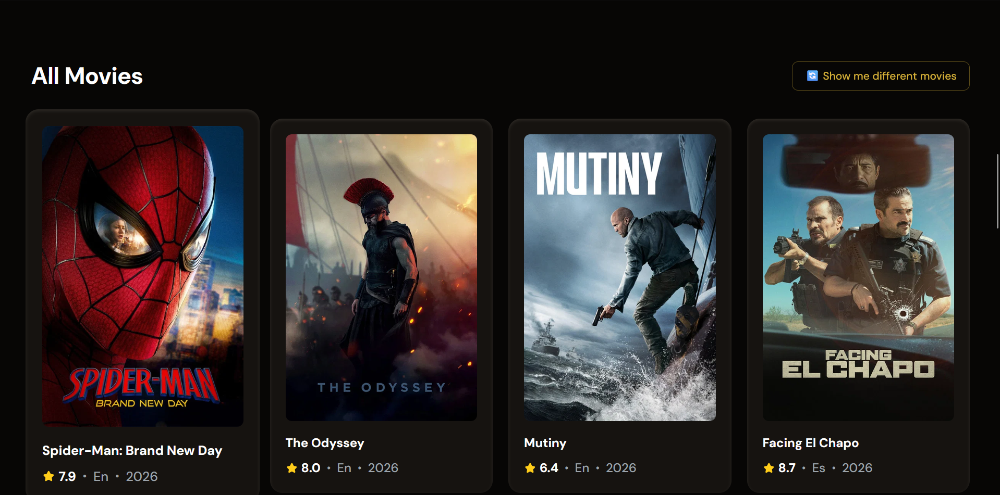
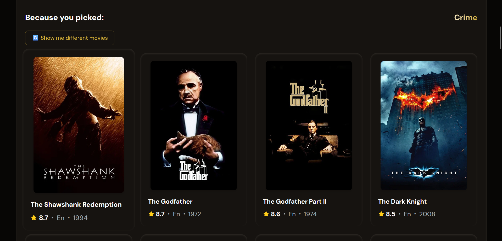
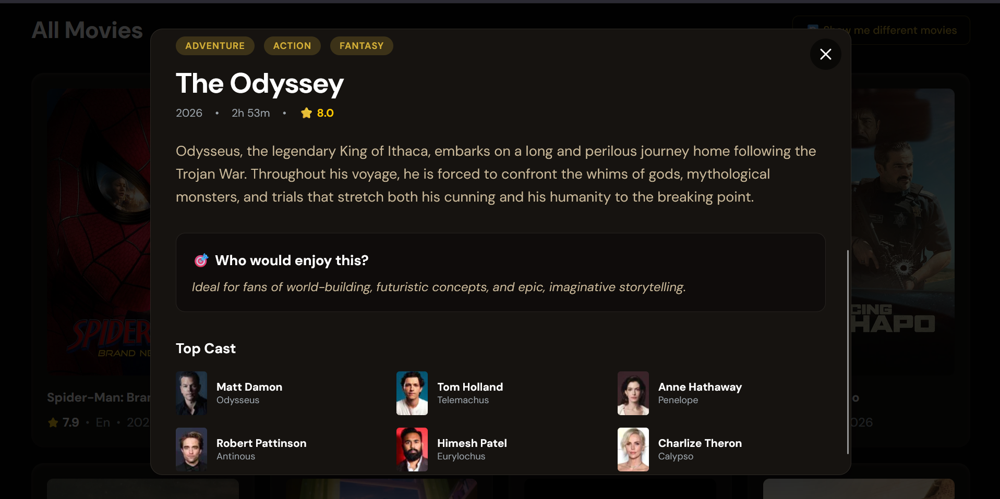
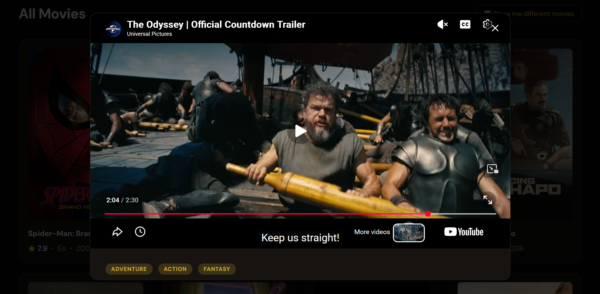
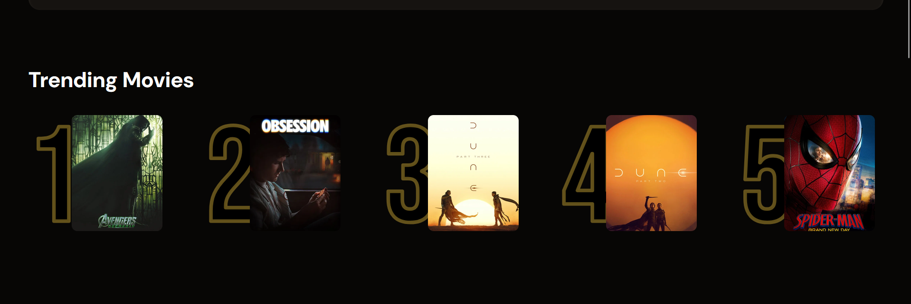

# 🎬 Aurea — Find Movies You'll Enjoy Without the Hassle

> A cinema-gold movie discovery engine. Search the world's largest movie database, get mood-based recommendations filtered for critically acclaimed films, and explore trailers, casts, and "who would enjoy this" insights — all wrapped in an Awwwards-inspired black & gold experience.

**Live demo:** [https://aureamovies.netlify.app](https://aureamovies.netlify.app)

     

---

## 📸 Screenshots

| Home Page | Genre Recommendations |
|:---:|:---:|
|  |  |

| Movie Details Modal | |Movie Trailer| Trending Movies |
|:---:|:---:|:---:|
|  |  |  |

---

## ✨ Features

- 🔍 **Debounced live search** across the full TMDB catalog
- 🏆 **Trending Movies** — a community-driven top 5 built from real user searches (persisted in Appwrite)
- 🎭 **Mood-based recommender** — pick genres, get heavy hitters only (rating ≥ 7.0 **and** 500+ votes), with paginated "show me different movies" refresh
- 🎬 **Cinematic details modal** — embedded YouTube trailer, top cast, runtime, rating, and a dynamic *"Who would enjoy this?"* audience profile
- 🥇 **Cinema Gold theme** — warm near-black + champagne gold, film-festival aesthetic
- ⚡ **Production-grade UX** — centered loading overlays, non-blanking grids, error states, zero console noise

---

## 🛠️ Tech Stack

| Layer | Technology |
|---|---|
| Frontend | React 19 + Vite |
| Styling | Tailwind CSS v4 |
| Movie data | TMDB API (discover, search, details, videos, credits) |
| Backend / DB | Appwrite Cloud (trending metrics) |
| Deployment | Netlify |

---

## 🚀 Getting Started

### Prerequisites
- Node.js 18+
- A free [TMDB API key](https://www.themoviedb.org/settings/api)
- A free [Appwrite Cloud](https://cloud.appwrite.io) account

### Run locally

```bash
git clone https://github.com/YOUR_USERNAME/YOUR_REPO.git
cd YOUR_REPO
npm install
```

Create a `.env` file in the project root:

```bash
VITE_TMBD_API_KEY=your_tmdb_key_here
VITE_APPWRITE_ENDPOINT=the_appwrite_endpoint
VITE_APPWRITE_PROJECT_ID=your_project_id
VITE_APPWRITE_DATABASE_ID=your_database_id
VITE_APPWRITE_TABLE_ID=your_table_id
```

```bash
npm run dev
```

---

## 🗄️ Appwrite Setup

Create a database with a `metrics` table containing:

| Attribute | Type | Notes |
|---|---|---|
| `searchTerm` | string | the searched movie title |
| `count` | integer | how many times it was searched |
| `poster_url` | string | poster of the top result |

**Permissions (security by design):** `create`, `read`, `update` → `any` · **`delete` → nobody.**
Registered platforms: `localhost` + your production hostname.

---

## 🔐 Security Notes

- All IDs/keys are client-side by design (they travel in every request); real protection comes from **Appwrite table permissions** (delete disabled) and **platform allow-listing**.
- Debug logs stripped for production.
- No secrets ever committed — environment variables only.

---

## 📁 Project Structure

```
src/
├── components/
│   ├── GenreSelector.jsx   # mood-based recommender + pagination
│   ├── MovieCard.jsx       # clickable poster card
│   ├── MovieModal.jsx      # trailer, cast, audience profile
│   ├── Search.jsx          # debounced search input
│   └── Spinner.jsx         # loading indicator
├── hooks/
│   └── useDebounce.js
├── appwrite.js             # trending metrics service
├── tmdb.js                 # TMDB service layer
├── App.jsx                 # composition + state orchestration
└── index.css               # Cinema Gold theme
```

---

## 🛣️ Roadmap

- [ ] Movie-to-movie recommendations ("if you loved *Dune*…")
- [ ] Watchlist with persistent storage
- [ ] Light "marquee" intro animation

---

## 🙏 Credits

- Movie data & artwork: **TMDB** — *This product uses the TMDB API but is not endorsed or certified by TMDB.*
- Backend: **Appwrite**

---

Built by **Oryan**